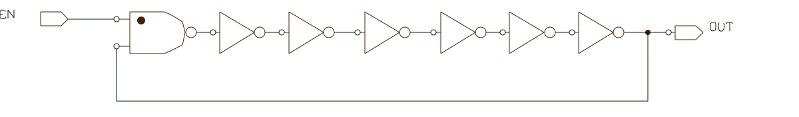
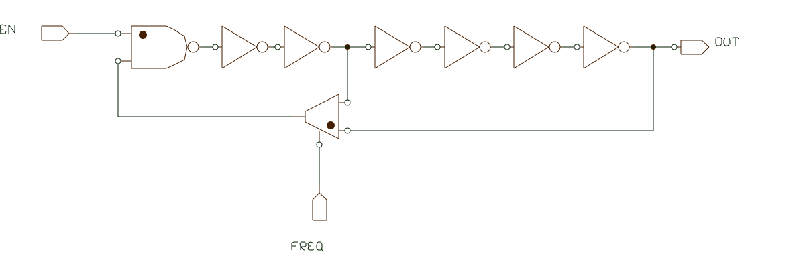

# Simulate ring oscilator (in gate level)

Basic ring oscillator:

- Describe the circuit in gatelvel.
- Enable input starts the operation.

- Simulation requires models of  cells (inverters and nand) to have delays.
- next assignment is design with control on frequency of the output.

This is just a illustration, It will not work in practice. (ring too short). 
- can You implement 8 frequencies design based on this idea?  The set of frequencies can be linear or geometrical series.

