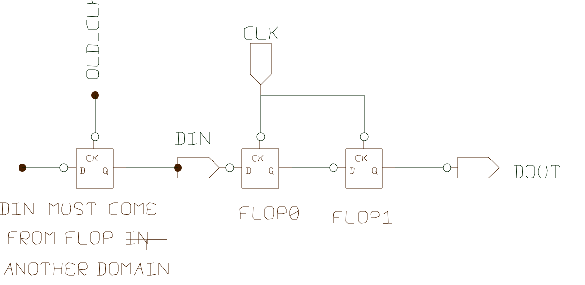

# Crossing clock domains

Big designs can have several clock domains. It means different clock frequencies or same frequency, but unknown phase relation.  Special care is required when signals carry info from one clock domain to  another.  The most common solution is to insert synchronizers on point of crossing.

## main types

### 1. level signals clock domain crossing
When stable (for many clocks) signal need to be crossed to another clock domain.
Standard solution is two-flip-flop-synchronizer. It might be 3 flops for super cautious.

module level_synchronizer (input clk, input din ,output dout);
always @(posedge clk) begin
    flop0 <= din;
    flop1 <= flop0;
end
assign dout = flop1;

endmodule

### 2. pulse signals clock domain crossing
    More complex situation. When input signal is a pulse. There is a risk that level synchronizer might
    miss it.

The assignment is to fill in:

module pulse_synchronizer (input clk_i, input clk_o, input din ,output out);
// put your code here.
// use level_synchorinzers as build block, if necessary.
endmodule

### 3. reset signals synchronizers.
Reset signal in one domain, is needed in another domain.
This is variation on level synchronizer.
hint: Best adding async reset.

## Assignment

Implement safe pulse clock domain crossing module. 

- There is an inherent problem with fast repeat pulses. Assume this problem doesnt exist.  
- Check the design works in fast to slow clock crossing and slow-to-fast as well.
- Realize it takes some time to acomplish the crossing mission. Don't mean the design+verification time.
