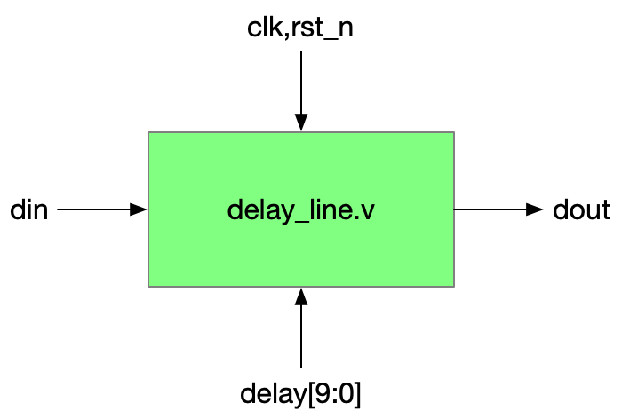
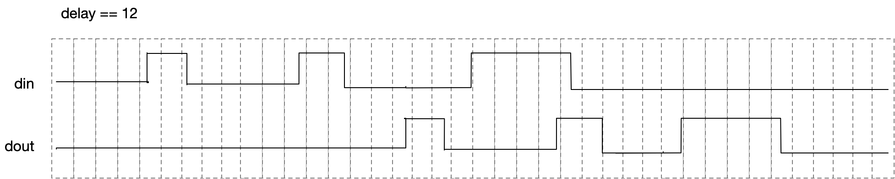

# DELAY LINE project
The idea is do delay digital bits stream by some amount of clocks.
The module runs on a clock (clk). Input "delay[11:0]" defines the amount of delay in clocks.
It samples the "din" input and  after "delay" number of clocks it replicates out on "dout".

### Assumption

There is limited number of transitions during delay time. Let say only 8 transitions can happen.

### Example of the behaviour

Not all changes are to scale. But You get the idea.

The naive implementation would be array of 4K flipflops . Shifting on every clock. To bit 0, din is pushed, "dout" is plucked from "delay" bit position.   The naive solution doesnt limit the number of changes.

This is valid solution. Can You do better?
