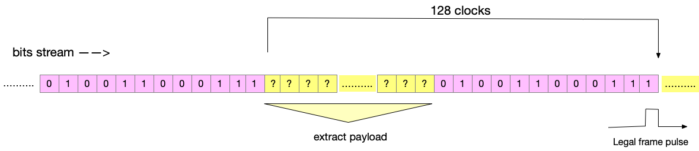

# Extract frames from stream of bits
## Goal
recognize in continious stream of bits, recurring pattern of 128 bits and sync on it.
The pattern is given and so it's length.
Each 128 bits are called a frame. Each frame starts with predefined sequence of 12 bits.
The assignment of the module is to extract legal frames - that is that start with 12 fixed bits and are followed by the same 12 bit sequence.

## In Out
| sig | dir | meaning |
|--|--|--|
| clk | i | clock |
| rst_n | i | active low async reset |
| din | i | continious flow of bits. looks like random sequence |
| synced | o | pattern caught and expect framevld  |
| framevld | o | pulses each time predefined pattern is recognized |
| payload[115:0] | o | valid on every framevld |

## Pattern

incoming bits follow frame structure. Each frame starts with fixed 12bits:  101100111000
then come 116 random bits which constitute the payload.
Notice that the 12 bits pattern may sporadically appear in the stream at any location. It will not start new frame and will not affect
the synchronization.
The synchronization is violated only when on next 128 bits the start pattern is wrong.

## Hysteresis
 Optional feature. 
 Define new input that tells the number of legal frames entering, before it is declared that design find synchronization.
 Define new input that tells the number of illegal frames entering, before synchronization nullified.

## Variation
define frame of 64 bits, that only markers are first bit being 1 and last bit being 0.

